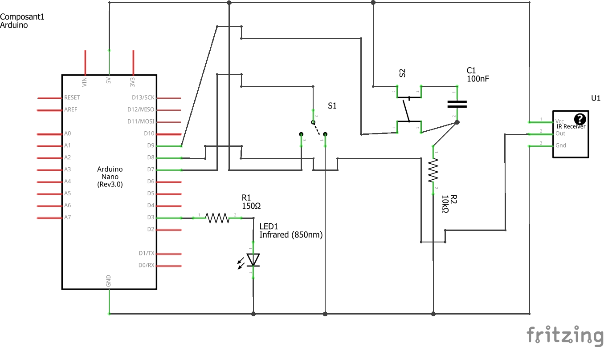

# TV Remote Cloner

Copyright (C) 2017 - Titi_Alone

Released under the GNU GPL General Public Licence v3.0 (see [Licence file](LICENCE))

Little tool that allows copying some TV remote code, store it into the Arduino EEPROM and send it back as much as you want.

Works with as little components as possible, Serial input for the code is even available if you don't have an appropriate IR receiver.

## Compatibility

You should be able to run this tool on every TV, but you may need to change some bits of code if you're not using a Samsung TV.

## How it works?
### Hardware

Of course, you need some hardware to run this code, here's a little list:

- an Arduino, every model should do, and I recommand Nano as it can be hidden easily ;
- an IR LED, this is required and cost only a few pennies ;
- a resistor, of 150 to 220 Ohm, depending on your LED ;
- an inverter switch, you can also use pushbutton, but less convenient ;
- a pushbutton ;
- a capacitor, value is not critical, around 100 - 220 nF is good ;
- another resistor, of 10 kOhm to 100 kOhm ;
- (optionnal) an IR receiver, not a simple phototransistor but a demodulated receiver.

And that's all, nothing you can't find in an old transistor radio, or buy for cheap at your local electronic store.

Here's the circuit you need to wire:

### Software

Everything you need is included ;).

No, really, you have to install the IR_remote library, but nothing too complicated:

- click on the directory of IR Remote above, this should teleport you to the Github repo ;
- then download all files as a zip and decompress all in you Arduino libraries/ directory ;
- that's it.
